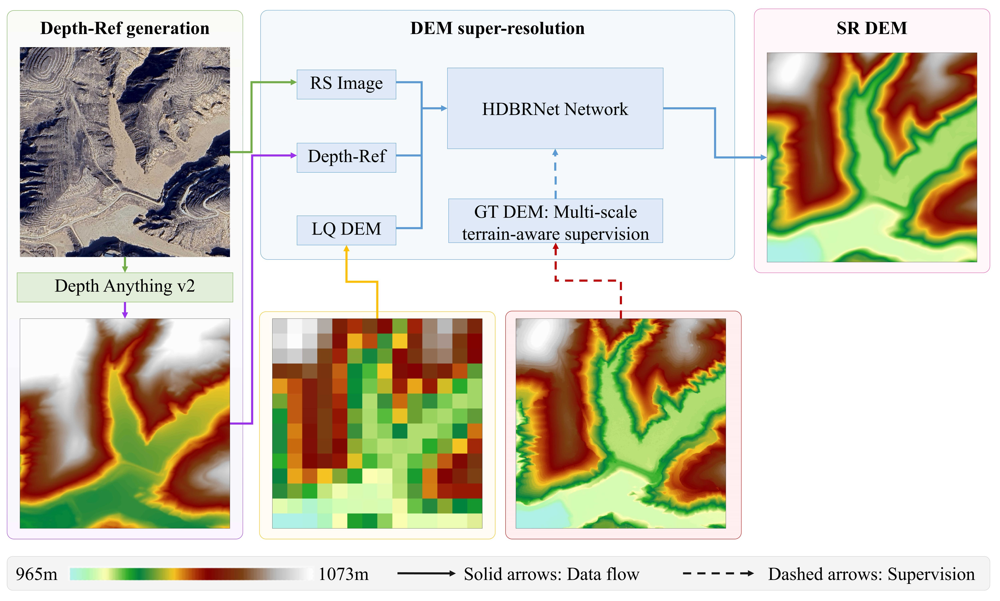
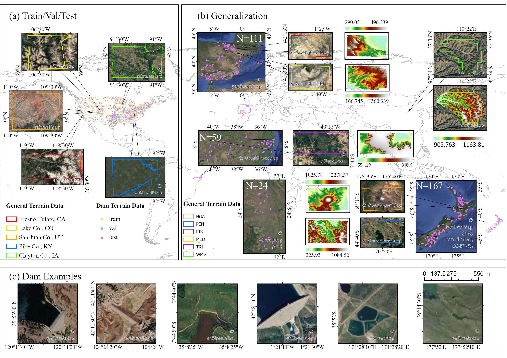
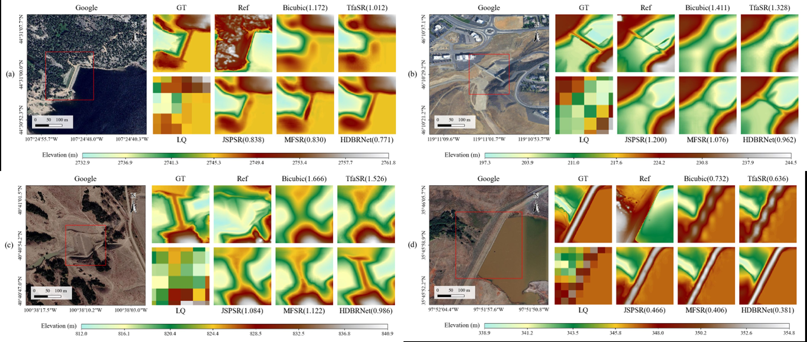

# HDBRNet
Recovering dam structures through reference-guided 32× DEM super-resolution

## Framework

HDBRNet performs reference-guided 32× DEM super-resolution using a low-resolution DEM together with high-resolution remote sensing imagery and a depth-based reference representation.

The Depth-Ref is generated from the remote sensing image using Depth Anything v2. During training, the ground-truth DEM provides multi-scale terrain-aware supervision. During inference, only the **LQ DEM, Depth-Ref, and RS image** are required.

<p align="center">
  
</p>

<p align="center">
  <em>Overview of the HDBRNet framework for reference-guided 32× DEM super-resolution.</em>
</p>

## Dataset and evaluation setting

The study evaluates HDBRNet using both **General Terrain Data** and **Dam Terrain Data**.

The training, validation, and test data cover geographically diverse terrain in the contiguous United States. Dam-focused samples are additionally included to investigate the recovery of spatially sparse anthropogenic terrain structures.

Independent generalization experiments are conducted in geographically separated external regions, including both general terrain and dam-focused test areas.

<p align="center">
  
</p>

<p align="center">
  <em>Spatial distribution of the training, validation, test, and external generalization data used in the study, together with representative dam examples.</em>
</p>

## Dam-structure recovery

A central objective of this study is to recover dam-related terrain structures that are weakly represented or absent in the low-resolution DEM.

The examples below compare Bicubic interpolation and three DEM super-resolution baselines with HDBRNet. The corresponding high-resolution remote sensing image, ground-truth DEM, reference representation, and low-resolution DEM are also shown.

<p align="center">
  
</p>

<p align="center">
  <em>Representative dam-structure reconstruction results on the U.S. test data. Values in parentheses denote elevation RMSE (m).</em>
</p>


## Software

To facilitate direct evaluation and use of HDBRNet, we provide a standalone Windows inference application corresponding to the model and inference configuration used in the manuscript. The software is implemented in C++17, with ONNX Runtime for neural-network inference, GDAL for GeoTIFF I/O, and Qt 6 for the graphical user interface. No Python, Conda, or PyTorch environment is required.

The application supports three input modes. **Single** processes one LQ–Ref–RS sample, **File List** processes multiple manually selected samples, and **Directory** processes valid samples from three selected directories. In the latter two modes, the three modalities are paired according to sample ID rather than file-selection or filesystem order. Dynamic batch inference is supported with batch sizes of `1`, `2`, `4`, `8`, and `16`; the final incomplete batch is processed directly without padding.

### Download

Prebuilt Windows x64 packages are available from the [GitHub Releases](../../releases/latest).

| Release | Package | Description |
|---|---|---|
| Windows CPU | `HDBRNet-v1.0-windows-x64-cpu.zip` | CPU inference version for Windows x64 systems; no NVIDIA GPU is required |
| Windows GPU | `HDBRNet-v1.0-windows-x64-gpu.zip` | CUDA-accelerated version for Windows x64 systems with a compatible NVIDIA GPU and driver |

The CPU package is approximately **170 MB** after compression, while the GPU package is approximately **1.71 GB** because the required CUDA and cuDNN runtime libraries are bundled with the application. Both packages are portable: download the appropriate ZIP archive, extract the complete directory, and run `HDBRNet.exe`. The extracted directory structure should be retained because the executable loads the model and runtime components from relative paths.

The CPU and GPU packages use the **same HDBRNet model, preprocessing procedure, input/output definition, and inference code**. Their difference is limited to the ONNX Runtime backend and the runtime libraries distributed with the application. The CPU release uses ONNX Runtime 1.30.0 with the CPU Execution Provider. The GPU release uses ONNX Runtime GPU 1.26.0 with the CUDA Execution Provider and includes the required CUDA 12.x and cuDNN 9.x user-space runtime libraries. Therefore, the GPU package does not require a separate CUDA Toolkit or cuDNN SDK installation, although a compatible NVIDIA GPU and NVIDIA driver are required.

### Input and output

HDBRNet v1.0 is designed for the standardized, pre-aligned input configuration used in the manuscript. **All three inputs are required to be GeoTIFF (`.tif` or `.tiff`) files.**

| Input | Format | Size | Bands | Requirement |
|---|---|---:|---:|---|
| **LQ** | GeoTIFF | 14 × 14 | 1 | Low-resolution DEM containing elevation values |
| **Ref** | GeoTIFF | 448 × 448 | 1 | Depth-Ref used for reference-guided reconstruction |
| **RS** | GeoTIFF | 448 × 448 | 3 | RGB remote sensing image |

The model therefore performs **14 × 14 → 448 × 448 reconstruction, corresponding to 32× DEM super-resolution**. LQ, Ref, and RS must already be spatially aligned before inference. A ground-truth DEM is not required by the released software; GT is used only during model training and quantitative evaluation.

The **Ref raster defines the spatial reference of the reconstructed DEM**. It must therefore contain valid geospatial metadata. Each prediction is written as a single-band `float32` GeoTIFF of size 448 × 448, and its coordinate reference system, GeoTransform, and NoData information are inherited from the corresponding Ref raster. HDBRNet does not use GT to construct output georeferencing.

The software follows the preprocessing used in the manuscript. LQ and Ref are normalized independently on a per-patch basis, with the standard deviation lower-bounded at 0.5. RGB values are scaled by 255 and converted to the model input representation. The predicted normalized elevation is finally converted back to physical elevation using the LQ statistics:

```text
lq_mean = mean(LQ)
lq_std  = max(std(LQ), 0.5)
LQ_norm = (LQ - lq_mean) / lq_std

ref_mean = mean(Ref)
ref_std  = max(std(Ref), 0.5)
Ref_norm = (Ref - ref_mean) / ref_std

RS = RGB / 255.0
gray = 0.299 R + 0.587 G + 0.114 B

SR = SR_norm × lq_std + lq_mean
```

For File List and Directory modes, filenames are matched using the sample identifier. For example, `184392_LQ.tif`, `184392_Ref.tif`, and `184392_RS.tif` are treated as one sample with ID `184392`. Missing or duplicated modalities are reported before inference rather than being silently paired.

### Usage

A typical workflow is straightforward. Start `HDBRNet.exe`, select **Single**, **File List**, or **Directory** mode, provide the corresponding LQ, Ref, and RS GeoTIFF inputs, choose an output directory, select the available device and Batch Size, and start inference. Reconstructed DEMs are written directly to the selected output directory as georeferenced GeoTIFF files.

The CPU release performs inference using the CPU Execution Provider. The GPU release supports `Auto`, `CPU`, and `CUDA` device modes. In `Auto` mode, the software attempts to initialize the CUDA Execution Provider and falls back to CPU if CUDA is unavailable. If `CUDA` is explicitly selected and CUDA initialization fails, the application reports the failure rather than silently switching to CPU.

### Windows release builds

The two v1.0 Windows packages were built from the same C++ inference implementation. No change was made to the HDBRNet network, model parameters, normalization procedure, dynamic-batch behavior, or GeoTIFF output logic between the CPU and GPU releases.

| Component | Windows CPU release | Windows GPU release |
|---|---|---|
| Architecture | Windows x64 | Windows x64 |
| Build type | Release | Release |
| Language | C++17 | C++17 |
| Qt | 6.11.2 (`msvc2022_64`) | 6.11.2 (`msvc2022_64`) |
| GDAL | 3.12.3 | 3.12.3 |
| PROJ | 9.x | 9.x |
| ONNX Runtime | 1.30.0 | 1.26.0 GPU |
| Execution Provider | CPU | CUDA / CPU |
| CUDA runtime | — | 12.9.x components |
| cuDNN | — | 9.26.0.51 |
| MSVC toolset | v143, 14.44.35207 | v143, 14.44.35207 |
| Windows SDK | 10.0.26100.0 | 10.0.26100.0 |
| CMake | 4.3.1 | 4.3.1 |

The graphical interface is built with Qt 6, GeoTIFF reading and writing are handled by GDAL, and model inference is performed through ONNX Runtime. The CPU package contains the runtime components required for CPU execution. The GPU package additionally includes the CUDA and cuDNN runtime libraries required by ONNX Runtime's CUDA Execution Provider.

The applications are distributed as portable builds. Users do not need to separately install Visual Studio, CMake, Qt, GDAL, ONNX Runtime, Python, Conda, or PyTorch. The GPU package also does not require a separate CUDA Toolkit or cuDNN SDK installation; only a compatible NVIDIA GPU and driver are required for CUDA execution.

### Scope and limitations

HDBRNet v1.0 is a research inference release corresponding to the standardized experimental configuration evaluated in the manuscript. It is not intended to serve as a general-purpose DEM preprocessing or GIS package. The current software expects preprocessed and spatially aligned GeoTIFF inputs and does not perform reprojection, resampling, automatic geometric registration, arbitrary-size raster tiling, or automatic correction of invalid terrain data. These operations should therefore be completed before inference.

The released application is intended primarily to provide a direct and reproducible implementation of HDBRNet inference for the configuration reported in the accompanying manuscript.

## Citation


## License

This project is licensed under the [Apache License 2.0](LICENSE).